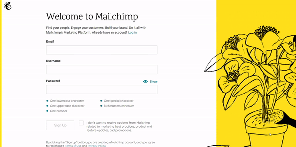
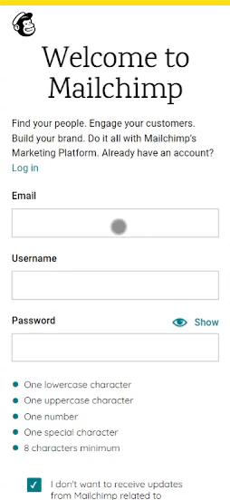

# HTML Form Project

<a href="https://kfig21.github.io/mailchimp_form/" target="_blank" rel="noopener noreferrer">View the project here!</a> 👀

<h3>Summary</h3>

This project was built for The Odin Project HTML/CSS curriculum. The goal of this project was to re-create a popular HTML form with HTML and CSS styling (<a href="https://login.mailchimp.com/signup/" target="_blank" rel="noopener noreferrer">Mailchimp form</a>). This project was made with the React JS Library and CSS.

<h3>Features:</h3>

- The accuracy of the UI re-creaction
- Using React hooks and regEx to recreate the functionality behind the UI (password requirements section to be specific)
- Custom checkboxes using only CSS
- Responsive design

<h3>Demo GIF</h3>

<h4>Desktop</h4>

<h4>Mobile</h4>

-----------------------------

<h3>Thanks for checking out my project! Any && all feedback is appreciated!</h3>
